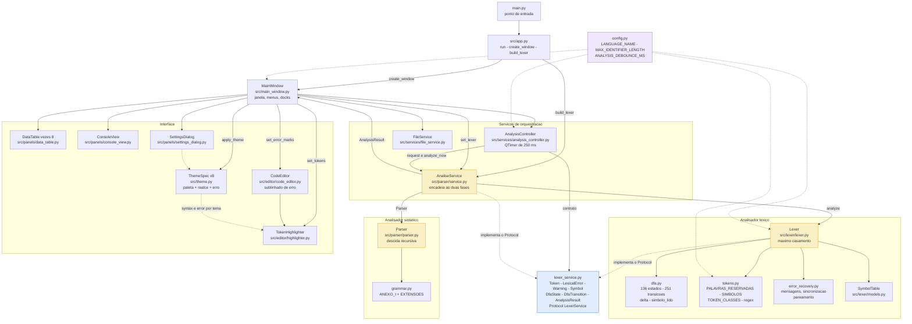

# Analisadores Lexico e Sintatico

Trabalho da disciplina de Compiladores: IDE e analisadores lexico e sintatico
para um dialeto da linguagem Pascal.

| | |
| --- | --- |
| Autores | Blendhon Pontini Delfino, Maria Clara Gueler Feitani |
| Implementacao | `src/lexer/` (lexico) e `src/parser/` (sintatico) |
| Testes | 621: `test_lexer.py` (135), `test_dfa.py` (139), `test_grammar.py` (26), `test_parser.py` (144), `test_highlighter.py` (43), `test_theme.py` (104), `test_background.py` (23), `test_icon.py` (7) |

O roteiro de apresentacao, com o passo a passo requisito por requisito e as
respostas para as perguntas provaveis, esta em `relatorio/checklist.md`. O programa
de demonstracao esta em `relatorio/exemplo.pas`.

---

## 1. Objetivo

O analisador lexico recebe o texto-fonte de um programa e produz uma sequencia
de tokens, cada um com seu lexema e sua posicao no arquivo. Sobre esse
resultado sao construidas a tabela de simbolos, o relatorio de erros lexicos e
a especificacao do automato finito deterministico que reconhece a linguagem.

O analisador sintatico consome essa sequencia e verifica se ela pertence a
linguagem gramatical, derivada do Anexo I. Ele acrescenta a estrutura de
controle `for` e, como ponto extra, os tipos `record` e enumeracao.

A interface em PySide6 consome esses dados em oito paineis (Tokens, Erros,
Avisos, Tabela de simbolos, Classes de tokens, DFA - estados, DFA - transicoes e
Gramatica) e sublinha em vermelho, no editor, cada erro encontrado.

---

## 2. Definicao da linguagem

### 2.1 Alfabeto

O alfabeto e o conjunto ASCII imprimivel. As letras do alfabeto sao exatamente
`[A-Za-z]`; nao ha acentos, conforme a regra `ID` da especificacao. Caracteres
fora dessa faixa nao pertencem a nenhuma classe de lexema e produzem erro
lexico.

### 2.2 Classes de lexemas

As tres classes de variaveis seguem a definicao da especificacao:

```
ID      -> [A-Za-z][letra | digito | _]*
NUM     -> digitos | digitos . digitos
LITERAL -> ' [letra | digito | CARACTERE_ESPECIAL]*

digitos -> dig digitos*
dig     -> [0-9]
```

Em regex, como exibido na aba *Classes de tokens*:

| Token | Expressao regular |
| --- | --- |
| `ID` | `[A-Za-z][A-Za-z0-9_]{0,14}` |
| `NUM` | `[0-9]+(\.[0-9]+)?` |
| `LITERAL` | `'(letra\|digito\|especial)*'` |

O limite de 15 caracteres de `ID` vem de `MAX_IDENTIFIER_LENGTH` em
`src/config.py`, fonte unica de verdade.

### 2.3 Palavras reservadas

| Lexema | Token | Lexema | Token |
| --- | --- | --- | --- |
| `program` | `PROGRAM` | `procedure` | `PROCEDURE` |
| `begin` | `BEGIN` | `function` | `FUNCTION` |
| `end` | `END` | `if` | `IF` |
| `const` | `CONST` | `else` | `ELSE` |
| `var` | `VAR` | `then` | `THEN` |
| `integer` | `INTEGER` | `while` | `WHILE` |
| `real` | `REAL` | `do` | `DO` |
| `char` | `CHAR` | `repeat` | `REPEAT` |
| `string` | `STRING` | `until` | `UNTIL` |
| `ou` | `OU` | `break` | `BREAK` |
| `e` | `E` | `continue` | `CONTINUE` |
| `for` | `FOR` | `downto` | `DOWNTO` |
| `to` | `TO` | `type` | `TYPE` |
| `record` | `RECORD` | `enum` | `ENUM` |

O reconhecimento **nao diferencia maiusculas de minculas**: `BEGIN`, `Begin` e
`begin` produzem o mesmo token `BEGIN`, e o lexema guardado e sempre o texto
original como aparece no arquivo.

A tabela tambem aceita `programa` como sinonimo de `program`, para que o modelo
de programa do editor (`src/config.py`) seja analisado sem erro.

As seis ultimas palavras reservadas (`for`, `to`, `downto`, `type`, `record` e
`enum`) foram adicionadas na segunda parte do trabalho, junto com o simbolo
`..` que permite escrever intervalos de enumeracao (`segunda..sexta`).

### 2.4 Simbolos

| Lexema | Token | Lexema | Token |
| --- | --- | --- | --- |
| `;` | `PONTO_E_VIRGULA` | `<=` | `MENOR_OU_IGUAL_QUE` |
| `.` | `PONTO` | `>=` | `MAIOR_OU_IGUAL_QUE` |
| `,` | `VIRGULA` | `+` | `ADICAO` |
| `:` | `DOIS_PONTOS` | `-` | `SUBTRACAO` |
| `=` | `IGUALDADE_COMPARACAO` | `*` | `MULTIPLICACAO` |
| `:=` | `ATRIBUICAO` | `/` | `DIVISAO` |
| `<>` | `DIFERENTE_DE` | `(` | `ABRE_PARENTESES` |
| `<` | `MENOR_QUE` | `)` | `FECHA_PARENTESES` |
| `>` | `MAIOR_QUE` | `[` | `ABRE_COLCHETES` |
| `..` | `INTERVALO` | `]` | `FECHA_COLCHETES` |

Os nomes dos tokens sao escritos em `UPPER_SNAKE_CASE` sem acentos, seguindo a
convencao ja presente no projeto (`PONTO_E_VIRGULA`). Acentos aparecem somente
em mensagens exibidas ao usuario.

### 2.5 Espacos em branco e comentarios

Sao descartados antes do reconhecimento e nao geram token.

| Forma | Descricao |
| --- | --- |
| `espaco`, `\t`, `\r`, `\n`, `\v`, `\f` | Espaco em branco |
| `//` | Comentario de linha, ate o fim da linha |
| `{ ... }` | Comentario de bloco, com aninhamento |
| `(* ... *)` | Comentario de parenteses, com aninhamento |

Na ambiguidade classica `(*x)`, o comentario tem precedencia e `(` so produz
`ABRE_PARENTESES` quando nao e seguido de `*`.

---

## 3. O automato finito deterministico

O reconhecedor e um unico AFD construido por refinamento das classes, com
**136 estados** e **251 transicoes**, disponivel nas abas *DFA - estados* e
*DFA - Transicoes*.

### 3.1 Nomes de estado

| Prefixo do nome | Significado |
| --- | --- |
| `q0` | Estado inicial |
| `q_id` | Estado de aceitacao do identificador |
| `q_num_inteiro`, `q_num_decimal`, `q_num_fracao` | Numeros |
| `q_lit_dentro`, `q_lit_fim` | Literais |
| `q_ponto_e_virgula`, `q_ponto`, ... | Um estado por simbolo simples |
| `q_dois_pontos`, `q_atribuicao`, `q_menor`, `q_menor_ou_igual`, `q_diferente`, `q_maior`, `q_maior_ou_igual` | Simbolos de dois caracteres |
| `q_kw_<prefixo>` | Um estado por prefixo de palavra reservada |

Os rotulos das transicoes sao classes de caracteres sempre que a regra agrupa
varios simbolos: `letra`, `digito`, `_`, `caractere especial`,
`quebra de linha` e `outra letra, digito ou _`. Os simbolos literais
(`,` `;` `(` `:=` ...) aparecem como eles mesmos.

### 3.2 Caminho do identificador

```
q0 --letra--> q_id --letra|digito|_--> q_id      (aceita ID)
```

### 3.3 Caminhos das palavras reservadas

As palavras reservadas nao tem estados proprios: elas compartilham o mesmo
automato do identificador por uma arvore de prefixos.

```
q0 --p--> q_kw_p --r--> q_kw_pr --o--> q_kw_pro --g--> q_kw_prog
    --r--> q_kw_progr --a--> q_kw_progra --m--> q_kw_program   (aceita PROGRAM)
```

Cada estado intermediario da arvore possui, alem da transicao para o proximo
prefixo, uma aresta `outra letra, digito ou _` que leva ao estado `q_id`. E o
que garante que `programador` seja reconhecido como um unico `ID` e nao como
`PROGRAM` seguido do resto:

```
programador --p--> q_kw_p --r--> ... --m--> q_kw_program (PROGRAM)
              --a--> q_kw_progr --outra letra, digito ou _--> q_id --r--> q_id ...
              => ID("programador")
```

Os prefixos compartilhados entre palavras sao fundidos em um unico estado. Por
exemplo, `e` (de `e ou`) e `else` passam pelo mesmo `q_kw_e`; `q_kw_e` e de
aceitacao (token `E`) e ao mesmo tempo tem aresta para `q_kw_el`.

### 3.4 Caminho dos numeros

```
q0 --digito--> q_num_inteiro --digito--> q_num_inteiro    (aceita NUM)
                       |
                       '.'
                       v
                 q_num_decimal --digito--> q_num_fracao --digito--> q_num_fracao
                                                       (aceita NUM)
```

`q_num_decimal` **nao** e um estado de aceitacao: o ponto so completa o numero
se vier seguido de pelo menos um digito. Com isso, o maximo casamento recua
corretamente:

| Entrada | Tokenization |
| --- | --- |
| `12` | `NUM(12)` |
| `12.34` | `NUM(12.34)` |
| `12.` | `NUM(12)`, `PONTO(.)` |
| `.5` | `PONTO(.)`, `NUM(5)` |
| `1.2.3` | `NUM(1.2)`, `PONTO(.)`, `NUM(3)` |

### 3.5 Caminho dos literais

```
q0 --'--> q_lit_dentro --caractere especial--> q_lit_dentro
                    |
                    "'"
                    v
              q_lit_fim (aceita LITERAL) --'--> q_lit_dentro
```

A aresta de volta para `q_lit_dentro` implementa o apostrofo duplicado do
Pascal: em `'d''art'` o segundo apóstrofo escapa o terceiro e o lexema todo e
um unico `LITERAL`. O rotulo `quebra de linha` nao possui aresta de saida, de
modo que um literal nunca atravessa o fim da linha.

### 3.6 Caminho dos simbolos

Os simbolos de dois caracteres sao construidos com estados intermediarios, o
que torna o maximo casamento uma consequencia da propria tabela de transicoes,
sem necessidade de lookahead no codigo:

```
q0 --':'--> q_dois_pontos (DOIS_PONTOS) --'='--> q_atribuicao (ATRIBUICAO)
q0 --'<'--> q_menor      (MENOR_QUE)      --'='--> q_menor_ou_igual (MENOR_OU_IGUAL_QUE)
                                                   --'>'--> q_diferente (DIFERENTE_DE)
q0 --'>'--> q_maior      (MAIOR_QUE)      --'='--> q_maior_ou_igual (MAIOR_OU_IGUAL_QUE)
q0 --'.'--> q_ponto      (PONTO)          --'.'--> q_intervalo (INTERVALO)
```

O ultimo par e o unico caso em que um simbolo aceita e um simbolo mais longo
compartilham o mesmo prefixo: `q_ponto` aceita, `q_intervalo` aceita tambem.
Como o scanner aplica maximo casamento e `a[1..5]` exige `..`, o resultado
depende apenas da proxima palavra, sem lookahead. O automato nunca fica na
posicao de aceitar os dois ao mesmo tempo para o mesmo sufixo lido.

### 3.7 Propriedades verificadas

`tests/test_dfa.py` verifica, sobre a tabela completa:

| Propriedade | Teste |
| --- | --- |
| Determinismo: nenhum par `(estado, simbolo)` aparece duas vezes | `test_automato_e_deterministico` |
| Todo destino e origem de aresta existe na tabela de estados | `test_todos_os_destinos_existem`, `test_todas_as_origens_existem` |
| Todo estado e alcancavel a partir de `q0` | `test_todos_os_estados_sao_alcancaveis` |
| Todo estado de aceitacao tem um token conhecido | `test_todo_estado_de_aceitacao_tem_token_conhecido` |
| Nenhum prefixo parcial de palavra e aceito | `test_prefixos_de_palavra_nao_sao_aceitaveis` |
| Maximo casamento produz o lexema esperado | `test_maximo_casamento_no_automato` |

---

## 4. O scanner

`src/lexer/lexer.py` conduz o automato aplicando **maximo casamento**: le
caracteres enquanto houver transicao e, a cada estado de aceitacao, memoriza a
posicao; ao travar, volta para a ultima posicao memorizada e emite o token.

Duas situacoes exigem cuidado no scanner:

1. **Ramo de palavra reservada abandonado.** Se o autOmato entra em um ramo de
   palavra reservada (`b`, `f`, `p`...) e trava antes de qualquer estado de
   aceitacao, o scanner reescreve o lexema desde o inicio como identificador.
   Sem isso, `b;` perderia o token `b`.
2. **Comentarios e espacos.** Sao tratados antes do autOmato, por nao
   pertencerem a nenhuma classe de lexema. Essa e a construcao classica de um
   lexer hibrido (reconhecedor + regras auxiliary), conforme o capitulo 3.4 do
   livro *Compiladores: princpios, construcao e ferramentas*.

Cada `Token` carrega tipo, lexema, linha, coluna e atributos. A coluna e a
linha sao **base 1**, exatamente o que `src/editor/code_editor.py` espera para
sublinhar o erro; `\r\n` conta como uma unica quebra de linha.

---

## 5. Erros lexicos e recuperacao

Todo erro e reportado com linha, coluna, lexema e comprimento, para que o editor
desenhe o sublinhado ondulado exatamente sobre o trecho errado.

| Situacao | Mensagem | Token emitido |
| --- | --- | --- |
| Caractere fora do alfabeto | `caractere inválido '@'` | nao |
| Identificador com mais de 15 caracteres | `identificador com 19 caracteres, o limite é 15` | sim, como `ID` |
| Literal nao encerrado | `lexema incompleto ou não reconhecido` | nao |
| Comentario nao encerrado | `comentário iniciado em '{' não foi fechado` | nao |
| Fechador sem abertura (`)`, `]`, `}`) | `')' sem '(' correspondente` | sim |
| Abertura nao fechada no fim do arquivo | `'(' não foi fechado antes do fim do arquivo` | nao |

As mensagens acima sao reproduzidas exatamente como o programa as escreve,
com acentuacao completa. O texto corrido deste relatorio, por sua vez, omite
acentos para nao depender da codificacao do editor ou do terminal.

A recuperacao tem tres estrategias:

- **Caractere isolado invalido**: registra o erro e avanca um caractere, sem
  interromper o restante do arquivo.
- **Construcao aberta** (literal nao encerrado): registra o erro e sincroniza
  ate o proximo `;` ou quebra de linha, para retomar a analise dali. A
  sincronizacao para *no* caractere de sincronizacao, sem consumi-lo, de modo que
  a quebra de linha continue alimentando a contagem de linha normalmente.
- **Pareamento de delimitadores** (`(` com `)` e `[` com `]`): uma pilha mantida
  durante toda a passagem localiza fecha faltando e fecha nao aberta.

Os pontos de sincronizacao do nivel de token (`begin`, `end`, `var`, `const`,
`procedure`, `function`, `;`) existem em `error_recovery.PONTOS_DE_SINCRONIZACAO`,
mas sao usados pelo analisador sintatico, que trabalha sobre tokens e nao sobre
caracteres. O lexer sincroniza apenas em `;` e `\n`
(`error_recovery.CARACTERES_DE_SINCRONIZACAO`).

Como o analisador nunca aborta, um arquivo com varios erros produce varios
erros em uma unica passagem.

---

## 6. Tabela de simbolos

Construida a partir do fluxo de tokens, percorrendo uma unica vez. Guarda a
primeira declaracao de cada identificador, na ordem em que aparece.

| Classe | Origem | Exemplo | Registro |
| --- | --- | --- | --- |
| `programa` | `programa N;` | `programa Ola;` | `Ola`, `programa`, linha 1 |
| `constante` | secao `const` | `const limite: integer := 10;` | `limite`, `constante`, `INTEGER`, valor `10` |
| `variavel` | secao `var` | `var contador: integer;` | `contador`, `variavel`, `INTEGER` |
| `procedimento` | `procedure N` | `procedure mostrar;` | `mostrar`, `procedimento` |
| `funcao` | `function N: T` | `function somar(...): integer;` | `somar`, `funcao`, tipo de retorno `INTEGER` |
| `parametro` | lista entre parenteses de subprograma | `(a: integer; b: integer)` | `a`, `parametro`, `INTEGER` |
| `tipo_enumeracao` | secao `type` | `type cor = (vermelho, verde);` | `cor`, `tipo_enumeracao` |
| `constante_enumeracao` | valores da enumeracao | `verde` | `verde`, `constante_enumeracao` |
| `tipo_registro` | secao `type` | `type ponto = record ... end;` | `ponto`, `tipo_registro` |
| `campo` | declaracoes internas do registro | `x, y: real;` | `x`, `campo`, `REAL` |

Listas de nomes (`var x, y, z: real;`) geram uma entrada por identificador.
Um tipo definido pelo usuario pode ser usado em variaveis, parametros e
retornos (`var p: ponto;`), e a coluna de tipo passa a exibir o identificador do
tipo em vez de um token primitivo. Um alias simples tambem e aceito
(`type inteiro = integer;`).

Redeclarar um nome **nao** e erro lexico: a primeira declaracao e mantida e um
**aviso** aparece na aba *Avisos*, apesar do primeiro uso.

---

## 7. O analisador sintatico

### 7.1 A gramatica como dados

`src/parser/grammar.py` guarda a gramatica do Anexo I como uma tabela de dados
em vez de codigo: cada producao e um par `(nome_do_nao_terminal, alternativas)`.
Isso tem tres vantagens praticas:

- a aba *Gramatica* da interface mostra as 40 producoes sem duplicar a
  especificacao em outra linguagem;
- os testes podem percorrer a tabela e conferir que todo terminal aparece em
  `src/lexer/tokens.py`, o que impede que a gramatica e o lexer saiam de sincronia;
- as extensoes da segunda parte sao acrescentadas como um segundo conjunto de
  producoes, deixando claro o que veio do enunciado e o que foi acrescido.

```
declaracoes -> declaracaoConst | declaracaoVar | declProc | ID (parametros) ; | ε
inst        -> ID := exprOp ; | ID (parametros2) ; | ...
declaracoes -> declaracaoTipo | ...              (extensao)
inst        -> FOR ID := exprOp (TO | DOWNTO) exprOp DO instrucao   (extensao)
```

As producoes `ID`, `NUM`, `LITERAL`, `digitos` e `dig` do Anexo I sao Definicoes
de lexema, nao regras de derivacao; elas ficam em `DEFINICOES_DE_LEXEMA` e sao
excluidas da lista de terminais quando o conjunto e conferido contra o lexer.

### 7.2 Descida recursiva

`src/parser/parser.py` implementa um analisador por descida recursiva com um
unico cursor sobre a tupla de tokens. A correspondencia entre os metodos e a
gramatica e direta: `_programa` para `programa`, `_instrucoes` para
`instrucoes`, `_expr` para `exprOp`, e assim por diante. Cada metodo consome
o token esperado, ou emite um erro e devolve `False`.

O resultado (`ResultadoSintatico`) carrega os erros, os avisos e as derivações
aplicadas, alem de ser `ok` somente quando nao ha erro nenhum.

### 7.3 Entradas da segunda parte

**`for`**. A regra `inst` ganhou as alternativas com `TO` e `DOWNTO`. O
inicio da sentenca e a unica posicao em que `for` e aceito:

```
for i := 1 to 10 do soma := soma + 1;
for i := 10 downto 1 do begin f(i); end;
```

`TO` e `DOWNTO` sao intercambiaveis em qualquer ordem de `DO` e do corpo, e o
corpo pode ser uma instrucao simples ou um bloco completo.

**Aviso de instrucao sem efeito.** Uma instrucao que contem apenas um
identificador seguido de `;` nao altera nenhum valor. O parser aceita a
sentenca, mas registra um aviso na aba *Avisos*:

```
instrução sem efeito: 'x' não altera nenhum valor
```

O aviso e emitido em vez de virar erro porque o enunciado pede um aviso. Para
que a regra nao reaja em falso positivo, o parser recebe a tabela de simbolos do
lexer e so emite o aviso quando o identificador **nao** e um procedimento ou
funcao declarados: nesse caso `Q;` e uma chamada legitima sem argumentos.

**`record` e enumeracao**. Como ponto extra, a secao `type` foi estendida:

```
type cor = (vermelho, verde, azul);
type dias = (segunda..sexta);          // intervalo, token ..
type ponto = record x, y: real; rotulo: string; end;
```

O acesso a campo (`p.x`) recebeu a producao `variavel -> ID . ID`. Sem ela o
`record` seria declarado e nunca lido, ja que o Anexo I nao preve acesso a
campo.

### 7.4 Erros sintaticos e recuperacao

Erros e avisos do parser reaproveitam o mesmo tipo de dado dos lexicos e sao
prefixados de `sintaxe:`, de modo que o sublinhado vermelho do editor funciona
sem nenhuma alteracao na interface.

```
sintaxe: esperado 'end' para fechar o registro
sintaxe: esperado ';' ao final da declaração de variável
sintaxe: esperado 'program' ou 'programa': o arquivo está vazio
```

A recuperacao usa a estrategia *panic mode*: apos registrar um erro, o parser
descarta tokens ate encontrar um ponto de sincronizacao (`;`, `.`, `begin`,
`end`, `then`, `else`, `do`, `until`) e tenta retomar ali. Duas garantias
evitam que o parser trave:

1. todo laco que consome tokens verifica se a posicao avancou e, se nao avanco,
   consome um token de qualquer forma;
2. um arquivo vazio gera **um** erro, e nao uma cascata de seis.

O parser so e executado quando o analisador lexico nao reportou nenhum erro
(`AnaliseService` em `src/parser/service.py`). Sem essa guarda, uma fonte com
um unico caractere invalido receberia dezenas de mensagens de sintaxe sobre uma
estrutura que nunca chegou a ser reconhecida.

---

## 8. Discrepâncias em relação à especificação

Registradas para conhecimento:

1. **`programa` alem de `program`.** A especificacao lista a palavra reservada
   `PROGRAM`, mas o modelo de arquivo do editor (`src/config.py`) usa `programa`.
   As duas grafias sao aceitas e produzem o mesmo token `PROGRAM`.
2. **Acentos rejeitados.** A regra `ID` da especificacao e ASCII estrita, entao
   `numero` e um identificador valido e `número` gera erro lexico no `ú`.
3. **Limite de identificador.** A especificacao nao diz o que fazer com um
   identificador maior que 15 caracteres. Adotou-se: emitir o token e reportar
   erro, para nao perder a informacao do lexema.
4. **Aspas duplicadas em literal.** Nao estao na regra `LITERAL`, mas sao
   padrao no Pascal e foram incluidas.
5. **Parametros facultativos.** O Anexo I exige `PROCEDURE ID ( parametros )`,
   mas o Pascal aceita `procedure Q;`. As duas formas sao aceitas.
6. **`;` antes do `)`.** Em `procedure Q(a: integer; b: real)` o ultimo
   parametro nao leva `;`. A lista de parametros foi escrita para acceptar as
   duas formas, evitando um erro espurio na sintaxe mais comum do Pascal.
7. **`;` antes do `else`.** O Anexo I mostra `instrucoes THEN inst ELSE inst`
   sem `;` entre os ramos; fontes escritas com `;` antes do `else`, que e o
   habito mais comum, tambem sao aceitas.
8. **`;` final facultativo.** O Anexo I escreve `ID := exprOp ;`, o que exige
   `;` na ultima instrucao de todo bloco. Nenhum Pascal real escreve
   `x := 1 end.`, entao o `;` passou a ser facultativo antes de `end`, `until`,
   `else` e `.`. No meio do bloco ele continua obrigatorio.
9. **Chamada de funcao em expressao.** O Anexo I usa `parametros2` apenas em
   `inst -> ID ( parametros2 ) ;`, o que torna `x := f(1)` indeDerivavel. Como
   `parametros2` ja e a lista de argumentos de chamada, foi acrescentada a
   producao `fator -> variavel ( parametros2 )`.
10. **`;` depois de bloco aninhado continua obrigatorio.** A producao do Anexo I
    e `bloco -> BEGIN instrucoes END ;`, e ela foi seguida a risca: um bloco
    usado como instrucao precisa do `;` depois do `end`. O item 8 acima tornou o
    `;` final facultativo dentro do bloco, mas nao alterou o `;` que vem
    *depois* do `end` de um bloco aninhado, porque ele pertence a producao
    `bloco` e nao a `instrucoes`. O Pascal real dispensa esse ponto e virgula:

    ```
    while i < 10 do
    begin
      i := i + 1
    end          <-- exigido por esta implementacao
    ```

    A forma aceita por esta versao e `end;`. A escolha e deliberada: seguir o
    Anexo I e mais previsivel do que aceitar duas regras diferentes para `;` na
    mesma posicao, mas e uma divergencia conhecida do Pascal usual, e nao um
    esquecimento.

---

## 9. Testes

```
python -m pytest tests\ -q
621 passed
python tests\smoke_ui.py
Todos os testes de fumaça passaram.
```

| Arquivo | Testes | Cobre |
| --- | --- | --- |
| `tests/test_lexer.py` | 135 | palavras reservadas (caixa alta, baixa e mista), 20 simbolos, maximo casamento, identificadores validos e fora do limite, numeros em todas as formas ambiguas, literais, as tres formas de comentario com aninhamento, espacos em branco, contagem de linha e coluna, `CRLF`, caracteres invalidos, fechadores, recuperacao de erro, tabela de simbolos e avisos |
| `tests/test_dfa.py` | 139 | determinismo, existencia de estados, alcancabilidade, aceitacao, ramos de palavra reservada, construcao do caminho dos numeros, dos literais e do intervalo `..`, maximo casamento, consistencia das tabelas exportadas |
| `tests/test_grammar.py` | 26 | transcricao do Anexo I, presenca das extensoes, terminais da gramatica existentes em `tokens.py`, producoes derivadas de todas as nao terminais e geracao das linhas exibidas na interface |
| `tests/test_parser.py` | 144 | programas validos e invalidos, `for` com `to` e `downto`, corpo simples e em bloco, `record`, enumeracao com e sem intervalo, acesso a campo, parametros com e sem parenteses, chamada de funcao em expressao, `;` final facultativo, aviso de instrucao sem efeito, ausencia de falso positivo em chamada de procedimento, recuperacao de erro e integracao com `AnaliseService` |
| `tests/test_highlighter.py` | 43 | realce por classe de token, negrito em palavra reservada e italico em comentario, cores padrao dos dois temas, preferencia sobrepondo o tema, as tres formas de comentario com aninhamento e multiplas linhas, token que passa do fim da linha, erro lexico sem derrubar o realce, repintura sem `textChanged` espurio, troca de tema no editor e integracao com a janela principal |
| `tests/test_theme.py` | 104 | registro dos oito temas, formato das 14 cores de paleta e das cores de realce, realce e erro proprios de cada tema novo, contraste minimo do texto, do realce e do erro sobre a base, `apply_theme` e o retorno ao tema do sistema, a escolha no dialogo de preferencias e o round-trip das preferencias |
| `tests/test_background.py` | 23 | presenca da imagem que acompanha o projeto, caminho valido, vazio e inexistente, faixa de opacidade, pintura efetiva do fundo lida pixel a pixel, ajuste que cobre a area em quatro combinacoes de proporcao sem deixar canto vazio, proporcao preservada, ampliacao de imagem menor que a area, reuso e invalidacao da escala, persistencia das preferencias e faixa propria do campo de opacidade |
| `tests/test_icon.py` | 7 | presenca da imagem e do `.ico`, leitura do diretorio do `.ico` conferindo 16, 32 e 256 px, transparencia do PNG, arte inteira e proporcional no quadro de 256 px, carga pelo `QIcon` e o contrato de `app_icon_file` com e sem o arquivo |
| `tests/smoke_ui.py` | 104 verificacoes | interface completa com o analisador real ligado em `src/app.py`, incluindo a aba *Gramatica*, e a aplicacao de cada tema na janela |

### 9.1 Realce sintatico

Alem da analise, o editor distingue visualmente as classes de token, para que
programas-fonte sejam lidos com mais rapidez. O realcador fica em
`src/editor/highlighter.py` e classifica cada token pela sua classe:

| Categoria | Tokens | Preferencia |
| --- | --- | --- |
| Palavra reservada | `program`, `begin`, `end`, `if`, `while`, ... (em negrito) | `keyword_color` |
| Tipo primario | `Integer`, `Real`, `String`, `Boolean`, `Char` | `primitive_type_color` |
| Numero | inteiros, reais e o intervalo `..` | `number_color` |
| Literal | cadeias entre aspas | `literal_color` |
| Comentario | `//`, `{ }` e `(* *)`, em italico | `comment_color` |

Identificadores e simbolos ficam com a cor normal do tema: o realce e estritamente
lexico e nao faz analise semantica de nomes, de modo que um identificador nunca
e pintado como palavra reservada por similarities ortograficas.

Como o lexer descarta os comentarios da sequencia de tokens, o realcador os
reconhece sobre o proprio texto, percorrendo o documento uma vez e guardando em
`previousBlockState` o bloco de comentario em aberto. O estado `-1` (nenhum
comentario) e o estado `0` (comentario aninhado) sao normalizados para que a
pintura possa ser refeita a qualquer momento.

Cada categoria tem cor padrao no tema escolhido (ver 9.2). As cores sao
ajustaveis na aba *Realce* das preferencias, que mostra uma previa ao vivo e
aceita `#rrggbb` ou nomes de cor do Qt; a preferencia vazia mantem a cor do tema.
Ao trocar as cores o documento inteiro e repintado.

Como o realcador trabalha sobre o mesmo documento que dispara `textChanged`, a
repintura e feita com os sinais do documento bloqueados. `rehighlight()` notifica
o documento, e sem esse bloqueio o editor leria a propria pintura como edicao do
usuario: marcaria o programa como modificado e pediria uma nova analise, o que
realimenta o ciclo analise -> realce -> analise sem nunca terminar. O
`tests/test_highlighter.py` cobre tanto a ausencia de `textChanged` espurio quanto
o fato de abrir a janela nao marcar o programa como modificado.

### 9.2 Temas

A paleta da interface vive em `src/theme.py`. Cada tema e um `ThemeSpec`
congelado com catorze cores (uma por papel da `QPalette`), as cinco cores do
realce sintatico e a cor do erro lexico. Sao oito temas embutidos, escolhidos
em *Preferencias > Aparencia*:

| Tema | Base | Destaque | Carater |
| --- | --- | --- | --- |
| Sistema | - | - | segue a paleta e o estilo do desktop |
| Claro | `#ffffff` | `#0078d4` | o claro original do projeto |
| Escuro | `#2d2d2d` | `#0078d4` | o escuro original do projeto |
| Oceano | `#16202b` | `#2f81f7` | azul-marinho de noite, acentos ciano |
| Sepia | `#fbf4e4` | `#b5651d` | papel creme, tinta marrom |
| Alto contraste | `#000000` | `#ffd400` | preto puro, destaque amarelo |
| Floresta | `#101a14` | `#2e9e6b` | verde-acinzentado, acento verde-agua |
| Solarized claro | `#fdf6e3` | `#268bd2` | paleta Solarized classica |
| Solarized escuro | `#002b36` | `#268bd2` | a mesma paleta sobre base escura |

O tema `system` nao tem `ThemeSpec`: `remember_system_appearance()` guarda o
estilo e a paleta no arranque, e `apply_theme()` os restaura quando ele e
escolhido. Para o tema do sistema, e tambem para um id desconhecido vindo de um
`settings.json` editado a mao, o realce cai na heuristica antiga: a luminosidade
da cor `Base` decide entre a tabela clara e a escura.

As cores de realce dos temas novos sao escurecidas ou clareadas em relacao a
base ate atingir razao de contraste WCAG de 3:1, e o texto do editor de 4,5:1.
`tests/test_theme.py` mede essa razao e falha se algum tema ficar ilegivel -
 Solarized claro, por exemplo, usa `#6e8000` no lugar do verde canonico
`#859900` justamente porque o canonico nao chegava a 3:1 sobre a base clara.

O caminho do tema percorre a cadeia inteira: `MainWindow.apply_settings()`
chama `apply_theme()` e depois `CodeEditor.set_theme()`, que guarda o id e
reaplica as cores do realce e do sublinhado de erro. `default_colors()` e
`error_color()` aceitam o id do tema como ultimo argumento, com a assinatura
antiga preservada, de modo que a heuristica continua valendo para quem nao
passa o id. Como sempre, uma preferencia explicita do usuario vence a cor do
tema, e a troca de tema repinta o documento inteiro.

### 9.3 Imagem de fundo do editor

Alem do realce, o editor aceita uma imagem de fundo. O padrao e o arquivo que
acompanha o projeto, em `img/`, resolving `default_background_image()` em
`src/config.py`; se a pasta nao existir, o padrao vira string vazia e a IDE
simplesmente abre sem fundo.

| Preferencia | Campo | Faixa |
| --- | --- | --- |
| Imagem | `background_image_path` | caminho de arquivo, vazio = sem imagem |
| Opacidade | `background_image_opacity` | 0 a 100 (padrao 10) |

A aba *Fundo* das preferencias oferece *Escolher...*, *Imagem do projeto* e
*Remover*, com previa ao vivo: cada movimento do controle de opacidade repinta o
editor atraves do mesmo caminho de `MainWindow._preview_settings`.

O desenho acontece em `CodeEditor.paintEvent`, antes de `super()`. O
`QPlainTextEdit` preenche o fundo do viewport antes de chamar este metodo, mas nao
o repoe aqui, ja que o documento desenha apenas o texto; por isso a imagem
sobrevive. O `QPixmap` e desenhado sobre um preenchimento com a cor `Base` do tema,
centralizado e com `setOpacity` conforme a preferencia.

O ajuste e o equivalente a `background-size: cover` de CSS:
`KeepAspectRatioByExpanding` escala a imagem ate ela cobrir os dois lados do
viewport e o excedente e cortado, em vez de deformado. Como a escala depende do
tamanho da area visivel, o pixmap resultante e memorizado por
`(tamanho do viewport, cacheKey do original)`, para nao reescalar a foto a cada
pintura. Um caminho vazio ou ilegivel deixa o editor sem fundo e devolve `False`, e
`MainWindow._apply_background` reclama do arquivo uma unica vez, para que um caminho
quebrado nao repita a mensagem a cada ajuste do controle.

O preenchimento da faixa dos numeros de linha nao e afetado: `LineNumberArea`
continua sendo pintada a parte com a cor `Window`, o que mantem a coluna legivel
mesmo com a imagem no maximo de opacidade.

### 9.4 Executavel e icone

O projeto tambem e distribuido como `dist\Guaxinim.exe`, um arquivo unico de
cerca de 43 MB, sem janela de console. O `Guaxinim.spec` descreve o empacotamento
com PyInstaller: `console=False` (a IDE e grafica), `onefile` e a exclusao de
`QtWebEngine`, `QtMultimedia`, `Qt3D`, `QtQuick` e `QtQml`, que o projeto nao usa e
que sozinhosrespondem por boa parte do tamanho.

O icone vem de `img/racoon.png`, uma imagem de 512x512 com canal alfa. O Windows
nao aceita PNG direto no recurso do executavel, entao `tools/make_icon.py` gera
`img/racoon.ico`: recorta a moldura transparente, reduz a arte com LANCZOS ate caber
no quadro de 256x256, centraliza e grava os sete tamanhos (16, 24, 32, 48, 64, 128 e
256). O quadrado e obrigatorio porque o diretorio do formato ICO guarda cada lado em um
byte, e um valor `0` ali significa 256; um recorte nao quadrado produziria entradas
como 32x24, que o Windows sabe ler mas que nao correspondem ao que se espera de um
icone.

A reducao antes de centralizar nao e um detalhe cosmetico. O desenho do guaxinim e
largo demais para o quadro, entao sobra largura e nao altura: colar a arte original
(512x378) direto num canvas de 256x256 colocaria o `paste` com offset negativo, e o
resultado seria um recorte central silencioso, com metade da largura e um terco da
altura da arte perdidos, sem nenhum erro. Foi exatamente o que aconteceu na primeira
versao do script, em que o `.ico` gerado saiu byte a byte igual ao recorte central de
256x256 do PNG. `tests/test_icon.py::test_ico_nao_corta_a_arte` existe para travar
isso: ele le o quadro de 256 px de dentro do proprio `.ico`, mede a silhueta e exige
que ela seja menor que o quadro (margem transparente) e que mantenha a proporcao do
PNG dentro de 2%, o que so acontece se a arte foi reduzida e nao cortada.

O mesmo PNG e usado em tempo de execucao, por `src/app.py`: `app_icon_file()`
devolve o caminho se o arquivo existir, e o `QIcon` vai para o `QApplication`, o
que cobre a janela, a barra de tarefas e o `Alt+Tab`. No Windows ainda e preciso
chamar `SetCurrentProcessExplicitAppUserModelID`, senao o Explorador agrupa a
janela sob o icone do `python.exe` em vez do icone do proprio programa; a chamada
fica isolada em `_claim_taskbar_identity` e so acontece nessa plataforma.

Um detalhe do modo *onefile* merece registro: dentro do executavel os modulos ficam
dentro do arquivo e `src/config.py` passa a ter `__file__` apontando para
`sys._MEIPASS/src/config.py`. Como o codigo ja derivava a raiz do projeto de
`parent.parent` de `__file__`, a raiz continua correta e `img/` e encontrada,
desde que as imagens sejam empacotadas com `--add-data`. Isso foi verificado com
uma construcao de teste que imprimiu a raiz e a presenca dos dois arquivos; had
sido apenas assumido, e uma imagem quebrada em ambiente congelado so apareceria
para quem usa o `.exe`.

As imagens vao no executavel apenas as usadas: `background.jpg` e `racoon.png`.

---

## 10. Diagrama de modulos

O programa esta em quatro camadas: entrada (`main.py` e `src/app.py`), servicos de
orquestracao, os dois analisadores com o contrato que os liga, e a interface. O
fluxo de uma tecla digitada e de um resultado de tela e sempre o mesmo:
`textChanged` dispara o debounce, o controlador chama o servico de analise, o
servico encadeia lexico e sintatico, e o `AnalysisResult` volta para a janela,
que atualiza o editor, as oito tabelas e o console.

O bloco seguinte e Mermaid, que o GitHub, o VS Code e o Typora renderizam. Para
quem abre em um leitor que nao understands Mermaid, a mesma figura esta renderizada
em `relatorio/diagrama_modulos.png`.



Tres decisoes do desenho merecem explicacao:

- **`lexer_service.py` define os dados, nao o algoritmo.** `Token`, `LexicalError`,
  `Symbol` e `AnalysisResult` sao dataclasses congeladas que vivem no modulo de
  contrato. Nao foi uma escolha estetica: e o que permite ao `lexer` importar o
  contrato sem ciclo de importacao, ja que o contrato tambem precisa conhecer os
  tipos de `dfa.py`.
- **`AnaliseService` implementa o mesmo `Protocol` do lexer.** A interface fala
  com `LexerService`, que e so a assinatura de `analyze`. Trocar `AnaliseService`
  por `Lexer` em `build_lexer` remove o parser da IDE sem alterar uma linha da
  janela. O teste `tests/smoke_ui.py` usa um duble com o mesmo Protocol para
  contar chamadas.
- **`theme.py` guarda a paleta, o realce e a cor do erro.** Um tema novo nao e
  so uma troca de cores: para que o editor, o dialogo e o smoke test concordem
  sobre a mesma cor, ela fica no `ThemeSpec` e desce por `set_theme()` ate o
  `CodeEditor`. Quem precisa de cor - e nao de paleta - le o tema; a paleta em si
  continua sendo responsabilidade da `QApplication`.
- **`config.py` e lido por todos os modulos.** `MAX_IDENTIFIER_LENGTH` e
  importado pelo `tokens.py` para montar a regex de `ID`, de modo que mudar o
  limite em um lugar so muda a regex, a validacao e a tabela deste relatorio.

---

## 11. Tabela de tokens

Gerada por `tools/gerar_tabela_tokens.py`, que le `src/lexer/tokens.py` e o
metodo `Lexer._atributos`. Para regenerar apos mexer nos tokens:

```
python tools/gerar_tabela_tokens.py --write
```

<!-- tabela-tokens:inicio -->
Um token por tipo reconhecido: 51 tipos, 52 entradas em `TokenClass`, porque `program` e `programa` sao o mesmo token `PROGRAM`.

A coluna **Expressao regular** reproduz literalmente o que a aba *Classes de tokens* da IDE mostra. As palavras reservadas vem com o prefixo `(?i)`, que e o jeito de escrever *case-insensitive* em regex. Os simbolos aparecem escapados (`+` como `\+`) porque e o que `re.escape` devolve.

Somente `ID`, `NUM` e `LITERAL` carregam atributo; palavra reservada e simbolo nao tem valor semantico. O par **Atributo** / **Valor** e o que o analisador sintatico usa para saber se `007` vale zero ou sete, e se `'d''art'` contem um ou dois apostrofos.

### 11.1 Classes de variaveis

| Token | Lexema | Expressao regular | Atributo | Valor |
| --- | --- | --- | --- | --- |
| `ID` | `contador` | `[A-Za-z][A-Za-z0-9_]{0,14}` | - | `contador` |
| `NUM` | `007` | `[0-9]+(\.[0-9]+)?` | `inteiro` | `7` |
| `NUM` | `3.14` | `[0-9]+(\.[0-9]+)?` | `real` | `3.14` |
| `LITERAL` | `'d''art'` | `'(letra\|digito\|especial)*'` | `6 caracteres` | `d'art` |

### 11.2 Palavras reservadas (28 tokens, 29 grafias)

| Token | Lexema | Expressao regular | Atributo | Valor |
| --- | --- | --- | --- | --- |
| `PROGRAM` | `program`, `programa` | `(?i)program` ou `(?i)programa` | - | - |
| `BEGIN` | `begin` | `(?i)begin` | - | - |
| `END` | `end` | `(?i)end` | - | - |
| `CONST` | `const` | `(?i)const` | - | - |
| `VAR` | `var` | `(?i)var` | - | - |
| `INTEGER` | `integer` | `(?i)integer` | - | - |
| `REAL` | `real` | `(?i)real` | - | - |
| `CHAR` | `char` | `(?i)char` | - | - |
| `STRING` | `string` | `(?i)string` | - | - |
| `PROCEDURE` | `procedure` | `(?i)procedure` | - | - |
| `FUNCTION` | `function` | `(?i)function` | - | - |
| `IF` | `if` | `(?i)if` | - | - |
| `ELSE` | `else` | `(?i)else` | - | - |
| `THEN` | `then` | `(?i)then` | - | - |
| `WHILE` | `while` | `(?i)while` | - | - |
| `DO` | `do` | `(?i)do` | - | - |
| `REPEAT` | `repeat` | `(?i)repeat` | - | - |
| `UNTIL` | `until` | `(?i)until` | - | - |
| `BREAK` | `break` | `(?i)break` | - | - |
| `CONTINUE` | `continue` | `(?i)continue` | - | - |
| `OU` | `ou` | `(?i)ou` | - | - |
| `E` | `e` | `(?i)e` | - | - |
| `FOR` | `for` | `(?i)for` | - | - |
| `TO` | `to` | `(?i)to` | - | - |
| `DOWNTO` | `downto` | `(?i)downto` | - | - |
| `TYPE` | `type` | `(?i)type` | - | - |
| `RECORD` | `record` | `(?i)record` | - | - |
| `ENUM` | `enum` | `(?i)enum` | - | - |

### 11.3 Simbolos (20)

| Token | Lexema | Expressao regular | Atributo | Valor |
| --- | --- | --- | --- | --- |
| `ATRIBUICAO` | `:=` | `:=` | - | - |
| `MENOR_OU_IGUAL_QUE` | `<=` | `<=` | - | - |
| `MAIOR_OU_IGUAL_QUE` | `>=` | `>=` | - | - |
| `DIFERENTE_DE` | `<>` | `<>` | - | - |
| `INTERVALO` | `..` | `\.\.` | - | - |
| `PONTO_E_VIRGULA` | `;` | `;` | - | - |
| `PONTO` | `.` | `\.` | - | - |
| `VIRGULA` | `,` | `,` | - | - |
| `DOIS_PONTOS` | `:` | `:` | - | - |
| `IGUALDADE_COMPARACAO` | `=` | `=` | - | - |
| `MENOR_QUE` | `<` | `<` | - | - |
| `MAIOR_QUE` | `>` | `>` | - | - |
| `ADICAO` | `+` | `\+` | - | - |
| `SUBTRACAO` | `-` | `\-` | - | - |
| `MULTIPLICACAO` | `*` | `\*` | - | - |
| `DIVISAO` | `/` | `/` | - | - |
| `ABRE_PARENTESES` | `(` | `\(` | - | - |
| `FECHA_PARENTESES` | `)` | `\)` | - | - |
| `ABRE_COLCHETES` | `[` | `\[` | - | - |
| `FECHA_COLCHETES` | `]` | `\]` | - | - |

### 11.4 Reconhecidos sem produzir token

Estes construcoes sao consumidas e descartadas antes do automato, porque nao pertencem a nenhuma classe de lexema:

| Constructo | Inicio | Fim | Observacao |
| --- | --- | --- | --- |
| `espaco`, `\t`, `\r`, `\n`, `\v`, `\f` | - | - | `Lexer._consumir_espaco` (`src/lexer/lexer.py`) |
| `//` | `//` | fim da linha | `Lexer._consumir_comentario` |
| `{ ... }` | `{` | `}` | aninhamento permitido |
| `(* ... *)` | `(*` | `*)` | aninhamento permitido |

<!-- tabela-tokens:fim -->